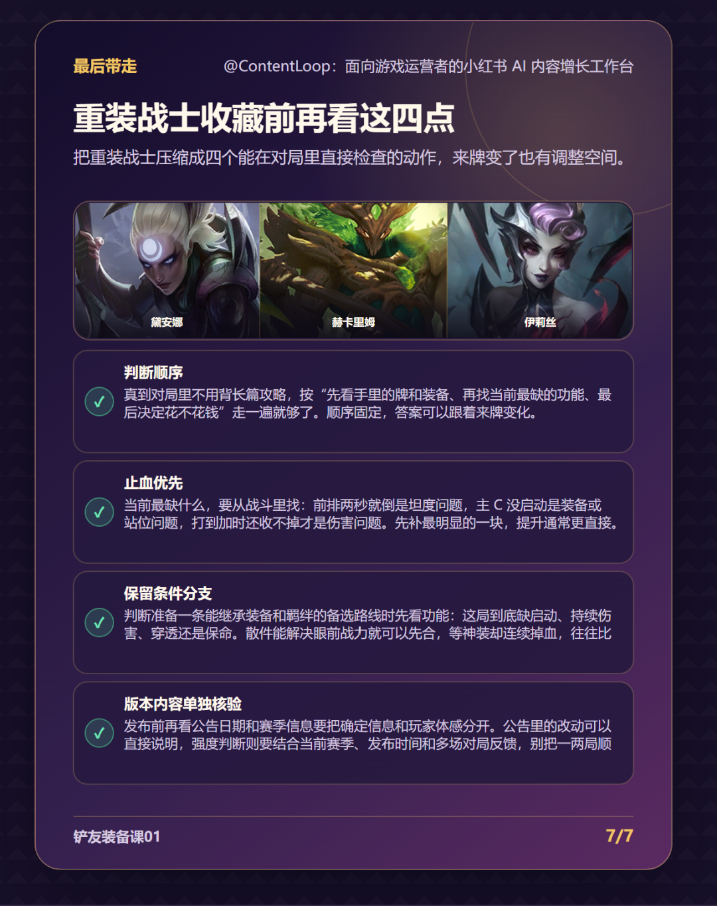

# ContentLoop｜游戏内容 AI 增长工作台

ContentLoop 是面向游戏内容运营与图文创作者的 AI 工作台。它把零散灵感、公开网页和游戏截图整理为可核对的研究材料，再生成候选选题、七页大纲、可编辑图文与发布文案。

[在线体验 ContentLoop](https://contentloop.bojingwang826.chatgpt.site) · [查看面试演示脚本](docs/面试演示包-v30.md)

> 在线 AI 功能可能需要访问码。访问码不写入公开仓库，请由项目所有者单独提供。

## 产品流程

```text
灵感 / 公开网页 / 截图
          ↓
  AI 理解与事实边界
          ↓
 差异化候选选题与研究卡
          ↓
   可逐页编辑的七页大纲
          ↓
  3:4 图文排版与高清导出
          ↓
  标题、正文、标签与发布包
```

1. 输入一句灵感、公开网页或游戏截图。
2. 检查系统识别出的文字、结构、来源和待核验项。
3. 从动态候选选题中选择方向，确认观点并生成七页大纲。
4. 逐页编辑、锁定或按自然语言要求调用 AI 重写。
5. 导出 1080×1440 PNG、七页 ZIP，以及配套标题、正文和标签。

## 界面预览

### 从统一输入进入选题研究


### 七页图文预览与导出



## 核心能力

- **输入理解**：支持灵感文本、公开网页和截图 OCR；识别结果先确认再进入创作链路。
- **动态选题**：围绕当前输入生成差异化候选题、研究卡、事实边界与待补问题。
- **真实 AI 改写**：逐页重写、整篇修改和发布文案共用服务端 AI 适配器，并根据用户修改意图更新正文。
- **编辑保护**：页面锁定、字段保留、撤销重做、命名版本和观点冲突检查共同保护人工修改。
- **内容自适应**：英雄数量、页面结构、图片布局与文本框高度根据主题和真实内容动态调整。
- **质量检查**：导出前检查文字截断、内容越界、缺失图标和结构异常；失败页可单独重试。
- **知识沉淀**：开发与发布记录持续同步到 Obsidian；网站端只写入用户确认的内容，不公开本地知识库。

## 本地运行

需要 Node.js 20.9 或更高版本。

```bash
npm install
npm run dev
```

浏览器打开 `http://localhost:4173`。未配置在线模型时，系统会使用免费演示 AI。

如需连接 DeepSeek，只在服务端环境中设置变量，不要把真实密钥或访问码写进代码、浏览器或提交记录：

```powershell
$env:DEEPSEEK_API_KEY="你的密钥"
$env:DEEPSEEK_MODEL="deepseek-v4-flash"
$env:AI_ACCESS_CODE="你的访问码"
npm run dev
```

## 验证

```bash
npm run check
npm test
npm run build
```

当前自动验证覆盖 AI 返回结构、字段白名单、重试与限额、截图识别、动态大纲、页面渲染、文字溢出和导出流程。

## 技术结构

```text
src/                  页面、领域逻辑与浏览器端服务
worker/               Cloudflare Worker 服务入口
scripts/              本地开发、检查与构建脚本
tests/                Node.js 自动测试
docs/                 演示材料与项目截图
.openai/hosting.json  Sites 项目标识与部署配置
```

- 前端：JavaScript、HTML、CSS、Vite
- 服务端：Cloudflare Worker 兼容 ESM
- AI：服务端 DeepSeek 接口，结构化输出校验与安全降级
- OCR：Tesseract.js 本地识别，并支持视觉模型增强
- 部署：OpenAI Sites

## 数据与安全边界

- DeepSeek API Key 和 AI 访问码只从服务端环境变量读取。
- `.env*`、`.dev.vars*`、构建产物和临时文件已在 `.gitignore` 中排除。
- 非官方网页链接仅作为用户参考，不展示在最终项目页面中。
- 未核验的赛季数值、强度结论和 OCR 小字会标记为待确认，不伪装成已验证事实。
- 演示榜单明确标注为非实时数据。

## 当前状态

核心创作链路已经可以在线体验：输入分析 → 候选选题 → 研究卡 → 七页大纲 → 图文编辑 → PNG／ZIP 导出。后续重点是继续提高截图小字识别、在线 AI 稳定性和更多游戏内容模板的覆盖度。
