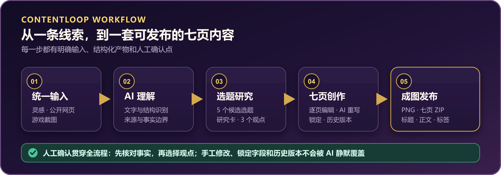
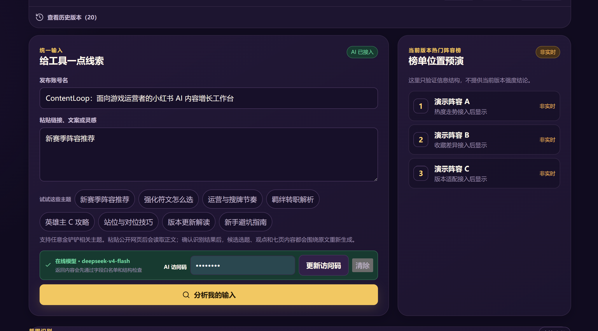
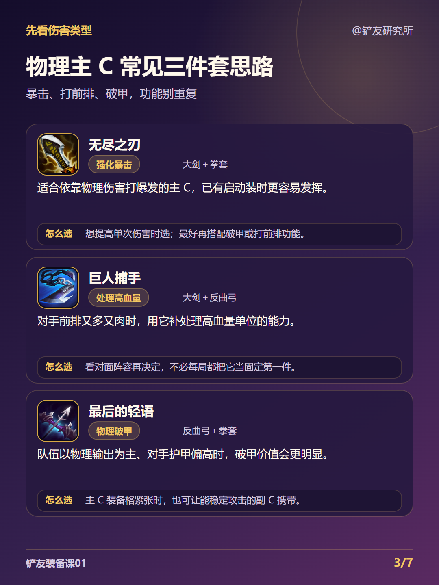

# ContentLoop｜游戏内容 AI 增长工作台

ContentLoop 是一套面向游戏内容运营与图文创作者的 AI 创作工作台。它把一句灵感、公开网页或游戏截图，逐步转化为可核对的研究材料、差异化选题、七页内容大纲、可编辑的 3:4 图文和发布文案。

当前首个完整场景是《金铲铲之战》内容创作。项目重点不是“一键生成一篇套话”，而是让用户在事实边界清楚、人工修改受保护的前提下，与 AI 共同完成整条内容生产流程。

[在线体验](https://contentloop.bojingwang826.chatgpt.site) · [GitHub 仓库](https://github.com/bojingwang826-png/contentloop) · [面试演示脚本](docs/面试演示包-v30.md)

在线体验会先进入简洁的产品理解页。首次访问者可以直接开始创作，也可以跳过 AI 配置，打开内置匿名七页样例查看完整效果。

[](https://github.com/bojingwang826-png/contentloop/actions/workflows/ci.yml)

> 在线 AI 和视觉识别功能可能需要访问码。访问码与模型密钥均不写入公开仓库，请向项目所有者单独获取。

## 产品预览

### 完整创作流程



### 从统一输入进入选题研究



### 实际生成的图文页面



## 为什么做 ContentLoop

游戏内容创作通常被拆散在搜索、截图识别、笔记、大纲、排版和发布文案等多个工具中。创作者不但要反复复制信息，还容易遇到三类问题：

- AI 把无法确认的数据写成事实，或者生成与当前版本、阵容无关的泛化内容；
- 修改过的标题、观点和页面正文，在下一次生成时被旧内容覆盖；
- 图文排版依赖固定模板，英雄数量变化后出现大片留白、文字截断或元素重叠。

ContentLoop 将“研究、判断、修改、成图”放进同一条可回退的工作流中。AI 负责理解和改写，用户负责确认事实、选择观点和控制最终表达。

## 完整工作流

| 阶段 | 用户输入 | 系统输出 | 用户控制 |
| --- | --- | --- | --- |
| 1. 统一输入 | 灵感文本、公开网页或截图 | 输入摘要、来源状态、OCR 文字与结构 | 可修正识别结果；未经确认的截图不会直接进入后续生成 |
| 2. 候选选题 | 已确认的输入材料 | 5 个差异化选题及推荐理由 | 选择方向，避免只生成一个不可比较的答案 |
| 3. 研究与观点 | 已选选题 | 研究简报、事实边界、待核验项、3 个观点 | 明确主张、证据与不能声称的内容 |
| 4. 七页大纲 | 已确认观点 | 严格七页的内容结构 | 逐页修改标题、说明和要点；锁定字段；按自然语言要求 AI 重写 |
| 5. 图文与发布 | 最终大纲与素材 | 1080×1440 页面、PNG、ZIP、标题、正文和标签 | 继续编辑、撤销重做、保存版本、单页重试和导出前检查 |

```text
灵感 / 公开网页 / 截图
          │
          ▼
输入理解、网页提取、OCR 与事实边界
          │
          ▼
5 个候选选题 ──► 研究简报 ──► 3 个可选观点
          │
          ▼
可逐页编辑、可锁定、可 AI 重写的七页大纲
          │
          ▼
动态 3:4 排版 ──► 质量检查 ──► PNG / ZIP / 发布文案
          │
          └────► 用户确认后写入本地 Obsidian 待确认区
```

## 核心能力

### 1. 有边界的 AI 内容生成

前后端通过统一任务协议处理六类 AI 工作：输入理解、网页内容提取、研究简报、七页大纲、字段改写和发布文案。模型返回结果必须通过字段白名单、结构和事实引用检查，才能进入项目状态。

- AI 只能引用请求中允许的事实 ID、来源 ID 和素材 ID；
- 逐页重写会读取用户刚修改的标题和重写要求，不是装饰性按钮；
- 被锁定或要求保留的字段不会被静默覆盖；
- 请求失败、超时或返回结构错误时保留原内容，并展示可理解的失败原因；
- 演示数据、未核验赛季数值和强度判断不会伪装成实时结论。

### 2. 网页来源提取与事实约束

公开网页会先经过服务端安全校验，再尝试直接读取正文；读取失败时可使用 Reader 降级。系统不会根据网页标题猜测正文，也不会把无法访问的内容包装成成功结果。

为降低 SSRF 风险，服务端拒绝本机、私网、带凭据或非 HTTP(S) 地址，并限制响应体大小。非官方链接可作为用户内部参考，但不会作为官方来源展示在最终项目页面中。

### 3. 本地 OCR 与可选视觉模型

截图识别采用双路径设计：

- 默认在浏览器内使用 Tesseract.js 和中英文模型，不上传原图；
- 对标题、分组、排名和小字区域进行分区识别与低置信度标记；
- 用户可编辑识别正文后再确认，避免错误文字直接污染选题；
- 经用户明确同意后，可把图片发送给 DeepSeek 视觉模型增强识别；
- 在线识别中断时保留本地结果，不把失败伪装为已完成。

### 4. 动态七页内容与真实游戏素材

七页结构固定，具体页面内容和布局并不固定。页面可根据英雄、羁绊、阵容、装备、规则等真实内容选择不同渲染方式。英雄数量不会被强行填满固定槽位，单英雄场景会放大主体，多英雄场景会自动调整密度。

项目内置 Riot 官方静态资源中的英雄与游戏图标；页面只使用已经解析并允许的素材 ID，不让模型凭空生成不存在的英雄或羁绊映射。

### 5. 编辑保护与版本历史

- 支持逐页编辑、AI 重写当前页和整篇内容更新；
- 支持页面与字段级锁定、保留人工排序和手动内容；
- 支持撤销、重做、自动历史、命名版本、删除与恢复；
- 自动历史最多保留 20 个版本，访问码不进入项目历史；
- 从第三步进入第四步时使用当前已保存的大纲，而不是最初生成的旧副本。

### 6. 自适应排版与导出检查

预览和导出共用同一份 Canvas 渲染模型，目标尺寸为 1080×1440。布局会根据文本和素材数量调整字号、行高、卡片高度与图片裁切方式。

导出前会检查文字溢出、素材缺失、结构异常和内容块越界。通过检查后可下载单页 PNG、七页 ZIP，以及配套的小红书标题、正文和标签。

### 7. 受控写回 Obsidian

网站使用 File System Access API 连接用户主动选择的 Obsidian Vault。连接后只写入：

```text
AI待确认/铲友创作台自动同步/
├── 当前草稿.md
└── 同步记录.md
```

写入前会验证所选目录包含 `.obsidian`。目录句柄仅保存在浏览器 IndexedDB 中，Vault 不会上传到服务端；未经用户确认的内容也不会自动进入正式知识区。该能力目前适合 Chrome 或 Edge。

## 技术架构

```text
浏览器
├── src/app.js                       路由、交互和工作流编排
├── src/domain/                      状态、AI 协议、历史、渲染、导出
├── src/services/                    AI、网页、OCR、视觉与 Obsidian 客户端
└── localStorage / sessionStorage / IndexedDB
              │
              ▼
Cloudflare Worker
├── POST /api/ai/tasks               文本 AI 任务
├── POST /api/ai/vision              截图视觉识别
├── POST /api/sources/extract        公开网页提取
├── POST /api/game/research          游戏公开数据研究
└── GET  /api/ai/status              在线能力状态
              │
              ├── DeepSeek Responses API
              └── 公开网页与游戏数据源
```

前端采用原生 JavaScript、HTML、CSS 与 Vite；服务端为 Cloudflare Worker 兼容 ESM。客户端和 Worker 共用领域层中的请求/响应结构校验，避免同一任务在不同运行环境中产生两套规则。

## 目录说明

| 路径 | 职责 |
| --- | --- |
| `src/app.js` | 五阶段页面、表单事件、项目状态和 UI 编排 |
| `src/styles.css` | 暗紫金视觉系统、响应式布局和可访问性样式 |
| `src/domain/` | Schema、历史、AI 协议、动态页面、Canvas 渲染、导出质量和 ZIP |
| `src/services/` | 浏览器端 AI、网页、OCR、视觉传输与 Obsidian 适配器 |
| `src/assets/` | OCR 运行时、语言模型、真实游戏图标和页面素材 |
| `scripts/` | 本地服务、AI/视觉/网页处理、静态检查和构建脚本 |
| `worker/` | 线上 API 与静态站点入口 |
| `tests/` | AI 契约、限流、OCR、动态页面、渲染和导出测试 |
| `docs/product/` | PRD、Schema 与历史设计记录；可能滞后于当前代码 |
| `design-system/MASTER.md` | 当前界面布局、字体、颜色和交互约束 |
| `.openai/hosting.json` | Sites 项目标识与部署配置 |

## 本地运行

### 环境要求

- Node.js 20.9 或更高版本
- npm
- Chrome 或 Edge（仅在测试本地 Obsidian 连接时需要）

```bash
git clone https://github.com/bojingwang826-png/contentloop.git
cd contentloop
npm install
npm run dev
```

打开 `http://localhost:4173`。没有配置 DeepSeek 时，文本创作链路会使用内置演示提供器，方便查看产品流程；它不代表在线模型结果。

### 服务端环境变量

变量只应设置在本地服务端或部署平台，不要放入前端代码、截图、Markdown 或 Git 历史。

| 变量 | 必需 | 默认值 | 用途 |
| --- | --- | --- | --- |
| `DEEPSEEK_API_KEY` | 在线 AI 必需 | 无 | DeepSeek 服务端密钥 |
| `DEEPSEEK_MODEL` | 否 | `deepseek-v4-flash` | 文本任务模型 |
| `AI_ACCESS_CODE` | 公开站建议配置 | 无 | 保护 AI 与视觉接口的访问码 |
| `AI_REQUESTS_PER_MINUTE` | 否 | `6` | 单分钟请求限制 |
| `AI_REQUESTS_PER_DAY` | 否 | `30` | 单日请求限制 |
| `PORT` | 否 | `4173` | 本地服务端口 |

PowerShell 示例：

```powershell
$env:DEEPSEEK_API_KEY="你的服务端密钥"
$env:DEEPSEEK_MODEL="deepseek-v4-flash"
$env:AI_ACCESS_CODE="你设置的访问码"
npm run dev
```

访问码只在当前浏览器会话中保存；关闭会话后可重新输入。它是对公开演示接口的轻量保护，不能替代正式账号、权限与计费系统。

## 测试与构建

```bash
npm run check
npm test
npm run build
```

- `npm run check`：检查关键文件和项目级静态约束；
- `npm test`：覆盖 AI 返回结构、字段白名单、重试与限额、OCR、动态大纲、历史、渲染和导出；
- `npm run build`：生成 Sites/Cloudflare 可部署产物，并检查客户端、服务端入口与托管配置。

提交前应至少运行与改动相关的测试；涉及 AI 契约、状态结构、排版或部署时，应运行全部三条命令。

## 数据、隐私与安全

| 数据 | 保存位置 | 生命周期 / 说明 |
| --- | --- | --- |
| 项目草稿与历史 | 浏览器 `localStorage` | 留在当前浏览器，可由用户清理 |
| AI 访问码 | 浏览器 `sessionStorage` | 仅当前会话，不进入项目或历史 |
| Obsidian 目录句柄 | 浏览器 `IndexedDB` | 用户授权后保存，可在浏览器撤销 |
| DeepSeek API Key | 服务端环境变量 | 不发送给浏览器、不进入仓库 |
| 截图原图 | 当前浏览器内存 | 默认本地 OCR；只有明确同意才发给视觉模型 |
| Obsidian 内容 | 用户本地 Vault | 只写入指定待确认目录，不上传整个 Vault |

`.env*`、`.dev.vars*`、构建产物、缓存与日志均被 `.gitignore` 排除。若密钥曾出现在截图、终端输出或 Git 历史中，应立即轮换，而不是只删除文件。

## 当前范围与非目标

当前版本已打通输入分析、候选选题、研究与观点、七页大纲、逐页改写、图文生成、质量检查、PNG/ZIP 导出和受控 Obsidian 写回。

目前不包含：

- 用户注册、团队空间与跨设备云同步；
- 自动发布到小红书或其他内容平台；
- 对所有游戏版本强度、胜率和榜单的实时保证；
- 对任意模糊截图中每一个图标小字的无人工校对承诺；
- 通用 CMS、社交账号管理或商业计费后台。

下一阶段重点是提高复杂截图的小字与结构识别、扩展更多游戏模板，并通过更多真实创作任务验证选题质量与编辑效率。

## 素材与许可说明

项目中的部分游戏头像与图标来自 Riot Games 的公开静态资源，仅用于产品原型和内容工作流演示；相关游戏名称和素材权利归原权利人所有。

本仓库采用作品集展示授权，而非开源许可证。公开可见仅用于作品审阅、技术评估和学习检查；未经书面许可，不得复制、修改、部署、分发或商用项目中的原创代码、文档和设计。完整条款见 [LICENSE](LICENSE)。安全问题请按 [SECURITY.md](SECURITY.md) 私下报告，不要在公开 Issue 中提交密钥、访问码或敏感日志。
